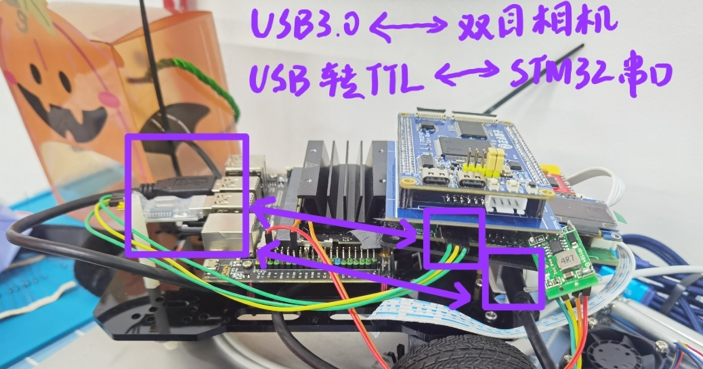

# Depth2Uart
#### 双目测距------双目相机V1.0，将双目相机采集到任意一点的深度数据进行串口传输

---

## 一、项目说明/Overview
所实现的功能：基于Intel Realsense官方提供的SDK，双目深度相机能获取到相机任何一个像素点距离前方障碍物的距离（即深度信息），并将深度信息串口数据发送至其它设备。

这个版本都是基于物理层上功能的实现，双目相机在这个工程当中只是作为了一个传感器使用，而Linux设备端也只做了双目相机的载体以及对双目采集到的深度信息进行串口传输，没有使用任何基于视觉相关的算法。
所以，这个版本肯定不是我们用上嵌入式设备的最终代码，大家可以把这个当作双目相机的一个入门工程来学习。

## 二、设备环境/Hardware

- 双目相机：能使用Intel Realsense SDK的深度相机均可实现功能，使用USB3.2的端口，这里我们使用的是Intel Realsense D435i深度实感相机；
- Linux设备：需要有两个及以上的USB口，可以选择树莓派、NVIDIA Jetson系列等主机，也可以使用虚拟机，测试使用的是Jetson Nano；
- 数据接收端: MCU系统，进行串口数据传输以及数据的使用，测试使用的是STM32进行串口数据接收。

## 三、使用方法/Usage
### 1、安装Ubuntu
推荐Ubuntu 18/20 LTS版本，兼容Ubuntu 22 LTS，本文部分依赖（如Intel Realsense SDK）官方文档暂未支持Ubuntu22，但实测可行。

### 2、安装ROS/ROS2
根据Ubuntu版本安装ROS/ROS2，安装方法可前往观看古月居/鱼香ROS相关视频，可使用一键安装脚本：https://github.com/fishros/install 。
本版本双目测距理论上不需要安装ROS系统，但安装ROS比较方便解决相关依赖，同时后续版本也会使用到就直接安装了。

### 3、安装Intel Realsense SDK
如出现问题可查看[Linux官方安装文档](https://github.com/IntelRealSense/librealsense/blob/master/doc/installation.md)

#### (1) 安装依赖
```
sudo apt-get install git libssl-dev libusb-1.0-0-dev libudev-dev pkg-config libgtk-3-dev libglfw3-dev libgl1-mesa-dev libglu1-mesa-dev
```
#### (2) 下载Intel Realsense SDK
``` 
git clone  https://github.com/IntelRealSense/librealsense.git
```
这行代码默认是下载的最新稳定版的SDK，现在只支持ROS2了，可以前往github仓库查看具体要求。
下载指定版本在git clone后加上-b，如Ubuntu18/20一般安装ROS，v2.50.0版本为支持ROS1的最后版本，就使用下面这个代码：
``` 
git clone  -b v2.50.0 https://github.com/IntelRealSense/librealsense.git
```
#### (3) 安装Intel Realsense SDK
```
cd librealsense
./scripts/setup_udev_rules.sh
mkdir build && cd build
cmake ..
make -j8
sudo make install
```
测试可以输入命令 realsense-viewer，可以看到一个软件打开，可以在此测试相机是否正常。

### 4、编译depth2uart.cpp
复制depth2uart.cpp(项目Software文件夹下)到Linux设备，在所在目录打开终端，输入以下代码编译cpp文件，生成depth2uart可执行文件，部分硬件可能会报错，可以根据报错查看缺少什么库文件，在最末尾加上-l再输入库名称。
```
g++ depth2uart.cpp -o depth2uart -lrealsense2 -lboost_system
```

### 5、给串口添加权限
输入以下命令可查询串口所在USB口。
```
ls -l /dev/ttyUSB* 
```
默认是USB0，输入以下命令给串口添加权限，如果是其他USB则需要修改USB后面数字。
```
sudo chmod 777 /dev/ttyUSB0
```

### 6、运行depth2uart
```
./depth2uart 
```
可以看到输出摄像头最中央一点的深度信息，数据串口发送至MCU系统接收。

### 7、设置开机自启动
开机自启动有很多种方法，比如在rc.local文件添加命令，即可开机自己动，可以上网查询。
这里推荐命令行输入‘gnome-session-properties’通过gnome设置开机自启动。

## 四、软件说明/SoftWare
具体代码见 2.Software/depth2uart.cpp 。
这个工程功能实现的原理：
- 串口数据的传输使用的是C++中的Boost库，这也是步骤4中增加-lboost_system的原因，使用其中的asio库实现IO操作。
- 双目相机数据的采集使用的是Intel Realsense官方的SDK,可以前往[官方GitHub仓库](https://github.com/IntelRealSense/librealsense)查看学习。

## 五、后续/Questions
1. 在这个工程中，传输的数据是某一点像素对应的深度值，仅仅获取这个数据在我们的嵌入式系统并没有太多的效果，所以在最终上嵌入式系统时，一般都是双向数据传输，将MCU设备端获取到的数据传输至Linux主控中进行计算，最后返回计算出来的控制信号给MCU端进行控制。
2. 往Linux设备增加算法，CPU本身是能计算的，同时Jetson Nano等还配备“显卡”能够加速视觉计算，后续可以运行OpenCV视觉算法以及TensorFlow等深度学习算法，搭配控制系统进行更高级的运用……
